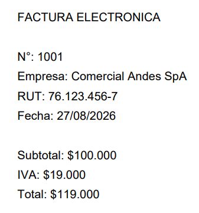
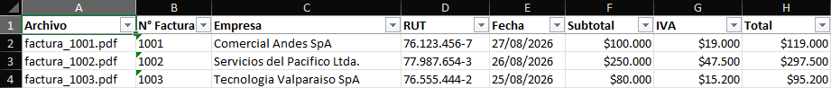

# PDF to Excel

Proyecto desarrollado en Python para procesar múltiples archivos PDF, extraer datos estructurados de facturas y generar automáticamente un archivo Excel con la información obtenida.

## Demo

### PDF de entrada



### Excel generado automáticamente



## Funcionalidades

- Lectura automática de múltiples archivos PDF.

- Extracción de los siguientes campos:
  - Número de factura.
  - Empresa.
  - RUT.
  - Fecha.
  - Subtotal.
  - IVA.
  - Total.

- Conversión de montos desde texto a valores numéricos.
- Validación de campos obligatorios.
- Detección de documentos con formato no reconocido.
- Detección y reporte de campos faltantes.
- Manejo de PDFs corruptos o ilegibles.
- Manejo de carpeta de entrada vacía.
- Exportación automática de resultados a Excel.
- Formato monetario para Subtotal, IVA y Total.
- Filtros automáticos en la hoja de resultados.
- Encabezados en negrita.
- Primera fila congelada para facilitar la navegación.
- Ajuste automático del ancho de las columnas.
- Manejo de errores al guardar el archivo Excel.
- Generación de facturas ficticias para pruebas.
- Tests automáticos con `pytest`.

## Tecnologías utilizadas

- Python
- PyMuPDF
- openpyxl
- ReportLab

## Estructura del proyecto

```text
pdf-to-excel/
│
├── input/
│   └── .gitkeep
│
├── output/
│   └── .gitkeep
│
├── src/
│   ├── main.py
│   ├── pdf_reader.py
│   ├── invoice_parser.py
│   └── excel_writer.py
│
├── tools/
│   └── generar_facturas_prueba.py
│
├── .gitignore
├── README.md
└── requirements.txt
```

## Instalación

### 1. Clonar el repositorio

```bash
git clone https://github.com/nicolasgaetedev/pdf-to-excel.git
```

Entrar a la carpeta del proyecto:

```bash
cd pdf-to-excel
```

### 2. Crear un entorno virtual

En Windows:

```bash
py -m venv .venv
```

### 3. Activar el entorno virtual

En PowerShell:

```powershell
.\.venv\Scripts\Activate.ps1
```

Una vez activado debería aparecer:

```text
(.venv)
```

al principio de la terminal.

### 4. Instalar las dependencias

```bash
python -m pip install -r requirements.txt
```

## Uso

### 1. Agregar archivos PDF

Coloca los archivos PDF que quieras procesar dentro de:

```text
input/
```

Por ejemplo:

```text
input/
├── factura_1001.pdf
├── factura_1002.pdf
└── factura_1003.pdf
```

### 2. Ejecutar el programa

Desde la carpeta raíz del proyecto:

```bash
python src/main.py
```

El programa procesará automáticamente todos los archivos `.pdf` encontrados en la carpeta `input`.

### 3. Resultado

El archivo Excel generado se guardará en:

```text
output/resultados.xlsx
```

El Excel contiene las siguientes columnas:

| Archivo | N° Factura | Empresa | RUT | Fecha | Subtotal | IVA | Total |
|---|---|---|---|---|---:|---:|---:|

## Ejemplo de ejecución

```text
✓ factura_1001.pdf
✓ factura_1002.pdf
✓ factura_1003.pdf
✗ documento.pdf - faltan campos: N° Factura, Empresa, RUT, Fecha, Total

Facturas procesadas: 3
Documentos ignorados: 1
Excel generado correctamente.
```

## Manejo de errores

El programa contempla diferentes situaciones que pueden ocurrir durante la ejecución.

### PDF corrupto o ilegible

```text
✗ Error al leer archivo_corrupto.pdf
```

El programa ignora el archivo problemático y continúa procesando los demás documentos.

### Documento con campos faltantes

```text
✗ documento.pdf - faltan campos: RUT, Fecha, Total
```

Los documentos que no cumplen con los campos obligatorios no se agregan al Excel.

### Carpeta de entrada vacía

```text
No se encontraron archivos PDF en la carpeta input.
```

### Excel abierto durante la ejecución

Si `resultados.xlsx` está abierto en Excel, Windows puede impedir que el programa lo sobrescriba.

En ese caso se mostrará:

```text
✗ No se pudo guardar output/resultados.xlsx. Comprueba que el archivo no esté abierto en Excel.
```

## Generar facturas de prueba

El proyecto incluye un script para generar facturas ficticias y probar el sistema sin utilizar documentos reales.

Ejecuta:

```bash
python tools/generar_facturas_prueba.py
```

Esto creará automáticamente archivos PDF de prueba dentro de:

```text
input/
```

## Arquitectura

El proyecto está dividido en módulos para separar responsabilidades.

### `main.py`

Coordina el flujo principal del programa.

```text
Buscar PDFs
    ↓
Leer PDF
    ↓
Extraer datos
    ↓
Validar factura
    ↓
Guardar resultados
    ↓
Generar Excel
```

### `pdf_reader.py`

Responsable de:

- Buscar archivos PDF.
- Abrir documentos PDF.
- Extraer su contenido de texto.
- Manejar errores de lectura.

### `invoice_parser.py`

Responsable de:

- Extraer datos utilizando expresiones regulares.
- Convertir montos a valores numéricos.
- Validar campos obligatorios.
- Detectar campos faltantes.

### `excel_writer.py`

Responsable de:

- Crear el archivo Excel.
- Generar las columnas.
- Insertar los resultados.
- Manejar errores al guardar el archivo.

## Dependencias

Las dependencias del proyecto se encuentran en:

```text
requirements.txt
```

Para instalarlas:

```bash
python -m pip install -r requirements.txt
```

## Notas

Los archivos dentro de las carpetas `input` y `output` no se suben al repositorio gracias al archivo `.gitignore`.

Esto evita subir:

- Documentos reales.
- Información privada.
- Archivos Excel generados.
- Archivos temporales.

El entorno virtual `.venv` tampoco se incluye en el repositorio.

## Limitaciones actuales

Esta versión está diseñada para PDFs digitales cuyo contenido siga una estructura reconocible.

Actualmente no incluye:

- OCR para PDFs escaneados.
- Interfaz gráfica.
- Soporte automático para múltiples formatos de factura.
- Configuración personalizada de campos.

Estas funcionalidades pueden incorporarse en futuras versiones.

## Estado del proyecto

**Versión 2.0**

Versión funcional y preparada como proyecto de portafolio.

## Autor

Desarrollado por **Nicolas Gaete**.